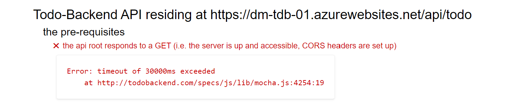

<!-- 
Guidelines on README format: https://review.docs.microsoft.com/help/onboard/admin/samples/concepts/readme-template?branch=master

Guidance on onboarding samples to docs.microsoft.com/samples: https://review.docs.microsoft.com/help/onboard/admin/samples/process/onboarding?branch=master

Taxonomies for products and languages: https://review.docs.microsoft.com/new-hope/information-architecture/metadata/taxonomies?branch=master
-->

# Todo Backend Implementation with Azure Functions, Node and Azure SQL


Implementation of the [Todo Backend API](http://www.todobackend.com/index.html) using Azure Function, Node and Azure SQL. 

## Unit Test

As per Todo Backend API specifications, unit test can be run via this link:

[Todo Backend Specs Unit Test](http://todobackend.com/specs/index.html?https://dm-tdb-01.azurewebsites.net/api/todo)

Keep in mind that I'm using the free tier of Azure Functions, so the runtime will go to sleep if no-one is using it. Wake up can take up to 30 seconds, so if you run the test you may get errors like the following:



If that happens run the test couple of times and you should see all test passing.

## Live Client

You can also test this implementation right using the live [ToDoMVC](http://todomvc.com/) test app:

[Todo Full-Stack Example](http://todobackend.com/client/index.html?https://dm-tdb-01.azurewebsites.net/api/ToDo)

## Full-Stack Implementation

If you are interested in a full-stack implementation that uses Vue.Js, Azure Static Web Apps, Node and Azure SQL, look here:

[TodoMVC Sample App Full Stack Implementation](https://github.com/Azure-Samples/azure-sql-db-todo-mvc)

# Setup Database

Execute the `/database/create.sql` script on a Azure SQL database of your choice, then use SQL Server Management Studio or Azure Data Studio to run the script. 

If you need any help in executing the SQL script on Azure SQL, you can find a Quickstart here: [Use Azure Data Studio to connect and query Azure SQL database](https://docs.microsoft.com/en-us/sql/azure-data-studio/quickstart-sql-database).

If you need to create an Azure SQL database from scratch, an Azure SQL S0 database would be more than fine to run this sample.

```
az sql db create -g <resource-group> -s <server-name> -n <database_+_name> --service-objective S0
```

Remember that if you don't have Linux environment where you can run [AZ CLI](https://docs.microsoft.com/en-us/cli/azure/install-azure-cli?view=azure-cli-latest) you can always use the [Cloud Shell](https://docs.microsoft.com/en-us/azure/cloud-shell/quickstart). If you prefer to do everything via the portal, here's a tutorial: [Create an Azure SQL Database single database](https://docs.microsoft.com/en-us/azure/azure-sql/database/single-database-create-quickstart?tabs=azure-portal).

If you are completely new to Azure SQL, no worries! Here's a full playlist that will help you: [Azure SQL for beginners](https://www.youtube.com/playlist?list=PLlrxD0HtieHi5c9-i_Dnxw9vxBY-TqaeN).


## Run sample locally

Make sure you add the information needed to connect to the desired Azure SQL database in the `local.settings.json`. Create it in the root folder of the sample using the `.template` file, if there isn't one already. After editing the file should look like the following:

```json
{
  "IsEncrypted": false,
  "Values": {
    "FUNCTIONS_WORKER_RUNTIME": "node",
    "AzureWebJobsStorage": "UseDevelopmentStorage=true",
    "db_server": "<server>.database.windows.net",
    "db_database": "<database>",
    "db_user": "todo-backend",
    "db_password": "Super_Str0ng*P@ZZword!"
  }
}
```

where `<server>` and `<database>` have been replaced with the correct values for your environment. Once done that, start local Azure Function host with

```bash
func start
```

if you are using [Azure Functions Core Tools](https://www.npmjs.com/package/azure-functions-core-tools) or using [Visual Studio Code Azure Function extension](https://marketplace.visualstudio.com/items?itemName=ms-azuretools.vscode-azurefunctions)

For more info on other options to run Azure Function locally look here:

[Code and test Azure Functions locally](https://docs.microsoft.com/en-us/azure/azure-functions/functions-develop-local)

Once the Azure Function HTTP  is up and running you'll see something like

```text
Now listening on: http://0.0.0.0:7071
Application started. Press Ctrl+C to shut down.

Http Functions:

        todo: [GET,PUT,PATCH,DELETE] http://localhost:7071/api/todo/{id:int?}
```

Using a REST Client (like [Insomnia](https://insomnia.rest/), [Postman](https://www.getpostman.com/) or curl), you can now call your API, for example:

```bash
curl -X GET http://localhost:7071/api/todo
```

and you'll a list of existing todo:

```json
[
  {
    "id": 549,
    "title": "azure function nodejs sample",
    "completed": false,
    "url": "http://localhost:7071/api/todo/549"
  }
]
```

## Debug from Visual Studio Code

Debugging from Visual Studio Code is fully supported, thanks to the [Visual Studio Code Azure Function extension](https://marketplace.visualstudio.com/items?itemName=ms-azuretools.vscode-azurefunctions)

## Deploy to Azure

If you want to the deploy this solution to Azure, you can take advantage of the script `azure-deploy.sh` that uses AZ CLI to deploy Azure Functions. It needs to be executed from a Linux shell. If you don't have one on your machine you can use [Azure Cloud Shell](https://azure.microsoft.com/en-us/features/cloud-shell). Just make sure you fill the needed settings into the `local.settings.json` as mentioned before as the script will read the values from there.

```bash
./azure-deploy.sh
```

It will care of everything for you:

- Creating a Resource Group (you can set the name you want by changing it directly in the .sh file)
- Creating a Storage Account
- Creating Azure Application Insights
- Create an Azure Function app
- Deploying repo code to Azure Function

Enjoy!

# Contributing 

This project welcomes contributions and suggestions.  Most contributions require you to agree to a
Contributor License Agreement (CLA) declaring that you have the right to, and actually do, grant us
the rights to use your contribution. For details, visit https://cla.opensource.microsoft.com.

When you submit a pull request, a CLA bot will automatically determine whether you need to provide
a CLA and decorate the PR appropriately (e.g., status check, comment). Simply follow the instructions
provided by the bot. You will only need to do this once across all repos using our CLA.

This project has adopted the [Microsoft Open Source Code of Conduct](https://opensource.microsoft.com/codeofconduct/).
For more information see the [Code of Conduct FAQ](https://opensource.microsoft.com/codeofconduct/faq/) or
contact [opencode@microsoft.com](mailto:opencode@microsoft.com) with any additional questions or comments.

More details in the full [Contributing](./CONTRIBUTING.md) page.
